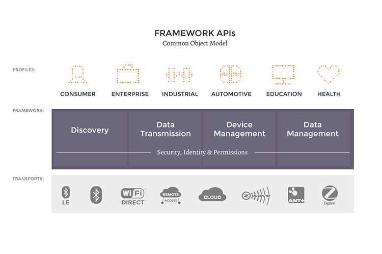

Introduction
==

# What is IoTivity?
>IoTivity is an open source software framework enabling seamless device-to-device connectivity to address the emerging needs of the Internet of Things.
>The IoTivity project was created to bring together the open source community to accelerate the development of the framework and services required to connect these billions of devices.

>The IoTivity project is sponsored by the Open Interconnect Consortium (OIC), a group of industry leaders who will be developing a standard specification and certification program to address these challenges.

>IoTivity will deliver an open source reference implementation of the OIC standard specifications, yet will not be limited to those requirements.

## Open Source License
>IoTivity code contributions are shared under the Apache 2.0 license.

# Architecture
>The IoTivity architectural goal is to create a new standard by which billions of wired and wireless devices will connect to each other and to the internet. The goal is an extensible and robust architecture that works for smart and thin devices.

## Yocto

> Layer containing recipes for building the Open Interconnect Consortium Iotivity framework

- [Yocto Meta-Oic](http://git.yoctoproject.org/cgit/cgit.cgi/meta-oic/about/)

## References

- 
- 
- 
- 
- 
